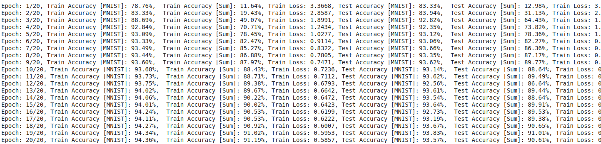

# E2A3

**Data Representation**

For MNIST, we load the dataset from the torchvision.datasets library. This is a \[60000 (10000) * 28 * 28 \] tensor for the train (test) set. For the input number and the output sum, we represent them using one-hot encoding.

For one-hot encoding, we use the `torch.nn.functional.one_hot` method.

**Data Generation**

The  random numbers are generated using the `torch.randint` module.

**Combination of MNIST and Random Numbers**

First, since it is intended that fully-connected layers will be used, the MNIST dataset is flattened into a \[60000 (10000) * 784 \] tensor for the train (test) set. Second, a new dataset is generated which has two inputs (MNIST data and random number) and two outputs (MNIST digit and sum). After this, the dataloader is created followed by the model and training loop.

Inside the model, the two inputs are fed to the network to yield the output. For predicting the sum, the MNIST digit is NOT fed to the layers. Instead, the second or third layer's output is fed as input since in this model, it has demonstrated better results. Also, the number of parameters is much less (and hence faster training!).

**Evaluation of Results**

We use the accuracy metric for this network. A simple comparison of the output of the model with our targets (followed by normalization) yields the percentage accuracy. Once again, two accuracy metrics are reported - one for the MNIST digit and the second for the sum.

**Results**

After the training ends (20 Epochs), the following accuracy is obtained on the train/test set.

| Metric  | Result |
| ------------- | ------------- |
| Train Accuracy (MNIST)  | 94.36%  |
| Train Accuracy (Sum)  | 91.19%  |
| Test Accuracy (MNIST)  | 93.57%  |
| Test Accuracy (Sum)  | 90.61%  |

**Loss Function**

Since our model has two outputs (both classification), we have two loss function - both are the Cross-Entropy loss function (since we have categories as outputs). But for gradient descent, we need a single loss function, so we sum the two loss function.

**Training Status**

Training is being done on the GPU. The model is moved to the GPU before training using the `model.to(device)` method. During training, the data is moved using `data.to(device)`.

